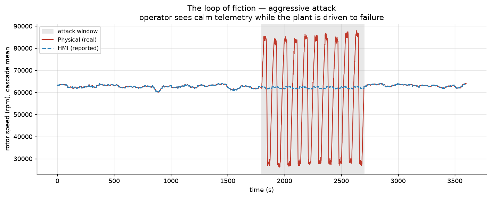
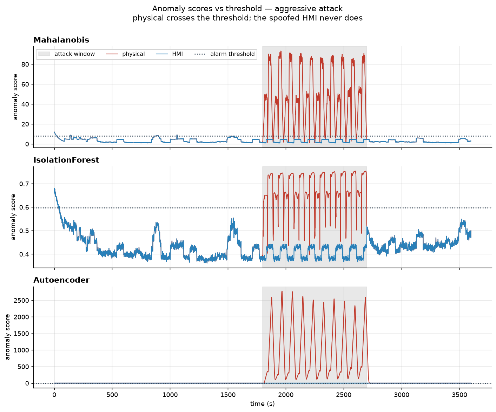
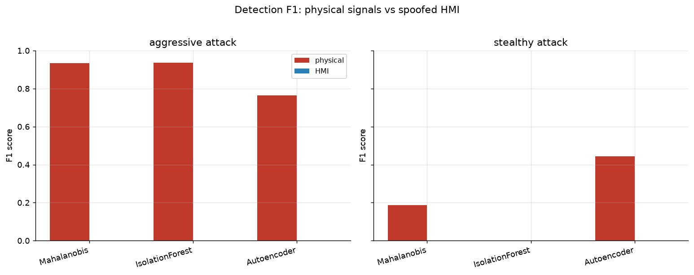

# 🛰️ BreachLab — catching a Stuxnet-style attack the sensors couldn't fake


An industrial-control-system (ICS) anomaly-detection demo inspired by the
**Stuxnet** attack on Iran's Natanz facility. Stuxnet physically destroyed
centrifuges while **replaying a recording of normal sensor readings** to the
operators — so their screens stayed calm during the sabotage.

This project reproduces that "loop of fiction" on **simulated** telemetry and
tests one idea:

> **If the operator's screen can be made to lie, can you still catch the attack
> by watching the physical signals the malware couldn't fake?**

The answer, quantified: **yes — and by a lot.**

> ⚠️ **Educational / research use only. All data is simulated. Nothing here
> references or targets any real system, and the physics constants are
> illustrative, not calibrated to real hardware.**

---

## The headline finding

Run three anomaly detectors twice — once on the real **physical** signals, once
on the spoofed operator **HMI** screen. Same detectors, opposite result:



*The real rotor speed (red) swings from ~27,000 to ~86,000 rpm during the attack,
while the operator's screen (blue) stays flat and calm. That gap is the lie.*

| Watching | Best detection (F1) | Attack caught (recall) | Verdict |
|---|---|---|---|
| **Physical signals** | **0.94** | up to **99.6%** | attack caught within seconds |
| **HMI (operator screen)** | **0.00** | **0%** | attack completely invisible |

The HMI detectors don't just fail — they score *below random* (ROC-AUC ≈ 0.3–0.4),
because a replayed loop of normal data looks **more normal than normal**.

---

## What is Stuxnet? (plain English)

In 2010, malware called **Stuxnet** was found targeting the industrial
controllers running Iran's uranium-enrichment centrifuges at Natanz. The
facility was air-gapped (no internet), so the attack is believed to have spread
via **USB**. It did two things at once:

1. **Damaged the machines** — periodically drove the centrifuge rotors past their
   safe speed and back down, wearing them out.
2. **Fooled the operators** — recorded ~21 seconds of normal sensor readings and
   **replayed them to the control-room screens** during the sabotage.

For months, engineers saw normal dashboards and blamed faulty equipment. An
estimated **~1,000 centrifuges** were damaged. Stuxnet is widely attributed to a
joint US–Israeli operation, though never officially claimed.

The takeaway BreachLab explores: **trust has to be anchored to something physical
the attacker can't reach.**

---

## How it works

```
Config → Simulator → physical + HMI telemetry
                          │
             Attack (actuator + replay) → corrupts both, labels every timestep
                          │
   Detectors.fit(normal)  → learn "normal", set alarm threshold (99th percentile)
                          │
   Detectors.score(...)   → anomaly score per timestep, on BOTH streams
                          │
   Evaluation             → precision / recall / F1 / ROC-AUC / PR-AUC / latency
                          │
   Visualization          → the figures below
```

1. **Simulator** ([`breachlab/simulator/`](breachlab/simulator/)) — a cascade of
   10 centrifuges. Every signal (vibration, power, temperature, wear) is *derived
   from one true rotor speed*, so the streams are always internally consistent.
   Includes benign anomalies (maintenance dips, sensor glitches) for realistic
   false-positive pressure.
2. **Attack** ([`breachlab/attacks/`](breachlab/attacks/)) — a man-in-the-middle
   that (a) drives the real speed into a damaging pattern and (b) replays
   pre-attack telemetry onto the HMI. Two variants: `aggressive` and `stealthy`.
3. **Detectors** ([`breachlab/detectors/`](breachlab/detectors/)) — three, all
   trained on normal data only, sharing a `fit`/`score` interface:
   - **Mahalanobis distance** — statistical baseline
   - **Isolation Forest** — scikit-learn
   - **Autoencoder** — a small PyTorch net over sliding windows (reconstruction
     error as the anomaly score)
4. **Evaluation** ([`breachlab/evaluation/`](breachlab/evaluation/)) — sweeps every
   `detector × source × variant` combination into a tidy results table.
5. **Visualization** ([`breachlab/viz/`](breachlab/viz/)) — presentation-ready
   matplotlib figures.

For a jargon-free walkthrough of the physics, see
[`docs/physics_explainer.md`](docs/physics_explainer.md).

---

## Results

Full sweep (10 centrifuges, 1-hour run, seed 42):

| Detector | Source | Variant | Precision | Recall | F1 | ROC-AUC | Latency |
|---|---|---|---|---|---|---|---|
| Mahalanobis | **physical** | aggressive | 0.95 | 0.92 | **0.93** | 0.98 | 5 s |
| Isolation Forest | **physical** | aggressive | 0.95 | 0.92 | **0.94** | 0.99 | 6 s |
| Autoencoder | **physical** | aggressive | 0.62 | 1.00 | **0.76** | 0.99 | 4 s |
| *all detectors* | *HMI* | aggressive | 0.00 | 0.00 | **0.00** | ~0.4 | never |
| Mahalanobis | **physical** | stealthy | 0.68 | 0.11 | 0.19 | 0.72 | 558 s |
| Isolation Forest | **physical** | stealthy | 0.00 | 0.00 | 0.00 | 0.65 | never |
| Autoencoder | **physical** | stealthy | 0.44 | 0.45 | 0.44 | 0.73 | 182 s |
| *all detectors* | *HMI* | stealthy | 0.00 | 0.00 | 0.00 | ~0.4 | never |

**Mean F1 — physical: 0.54  ·  HMI: 0.00.** The stealthy attack is deliberately
much harder to catch (see limitations).




---

## Quick start

```bash
# 1. Clone and enter
git clone <your-repo-url> && cd breachlab

# 2. Create a virtual environment and install
python -m venv .venv
source .venv/bin/activate        # Windows: .venv\Scripts\activate
pip install -r requirements.txt

# 3. Run the full pipeline (prints results, saves CSV + Markdown + figures)
python -m breachlab run

# Run just one attack variant
python -m breachlab run --attack stealthy --duration 1800 --seed 7

# 4. Launch the interactive dashboard
python -m breachlab dashboard
```

Outputs (results table + figures) are written to [`outputs/`](outputs/).

### CLI options

```
python -m breachlab run
  --attack {aggressive,stealthy,both}   attack variant (default: both)
  --config PATH                         a config.yaml to load
  --duration SECONDS                    run length
  --seed INT                            master RNG seed
  --n-centrifuges INT                   cascade size
  --intensity FLOAT                     attack intensity multiplier
  --output-dir PATH                     where to write results/figures
  --no-figures                          skip figure generation
```

All configuration lives in [`config.yaml`](config.yaml) /
[`breachlab/config.py`](breachlab/config.py) — no magic numbers scattered around.

---

## Project structure

```
breachlab/
  config.py          # typed dataclasses + YAML loader (single source of truth)
  logging_utils.py   # configured logger (no bare prints in library code)
  simulator/         # centrifuge-cascade physics + benign anomalies
  attacks/           # replay + actuator manipulation, variants, labels
  detectors/         # statistical, isolation forest, autoencoder + shared base
  evaluation/        # metrics, experiment runner, results tables
  viz/               # matplotlib figures
  dashboard/         # Streamlit app (stretch goal)
  cli.py             # `python -m breachlab run` / `dashboard`
tests/               # pytest: simulator, attacks, detectors, evaluation, viz
docs/                # physics explainer, images, article draft
outputs/             # generated results + figures (git-ignored)
```

---

## Testing

```bash
pytest              # 37 tests: simulator, attack labelling, detector interface, metrics
```

Everything is **reproducible**: all RNGs (NumPy, scikit-learn, PyTorch) are seeded,
so the same seed produces identical output.

---

## Honest limitations

This is a demonstration of an *idea*, not a deployable defence:

- **It's a simulation.** Constants are plausible but not calibrated to real IR-1
  centrifuges.
- **The deck is partly stacked by construction:** the physical stream contains the
  attack, and the HMI is a *perfect* replay. So "physical wins" is expected — the
  value is in **demonstrating and quantifying** the principle. The **stealthy**
  variant (which most detectors catch poorly, and Isolation Forest misses
  entirely) is the honest counter-evidence.
- **The 0% HMI result depends on the replay being a clean loop.** My detectors
  check whether readings look *abnormal*; they don't check for *repetition*. A
  detector that looked for a looping signal could catch the replay — a natural
  next step.
- **Each detector watches one stream.** The single strongest detector — "does the
  physical stream **disagree** with the HMI?" — is not implemented here (it's a
  planned physics-consistency detector).
- **Offline/batch, not real-time streaming.** And it models only the
  sensor→screen deception, not the PLC-level subversion real Stuxnet also used.

---

## Sources & further reading

- Falliere, Murchu & Chien, *W32.Stuxnet Dossier* (Symantec, 2011) — the
  definitive technical teardown.
- Kim Zetter, *Countdown to Zero Day* (2014) — book-length account of Stuxnet.
- Langner, *To Kill a Centrifuge* (2013) — analysis of the physical attack logic.

---

## License

[MIT](LICENSE) © 2026 Kewal Dharamshi. Built as a learning project — corrections
and suggestions welcome.
